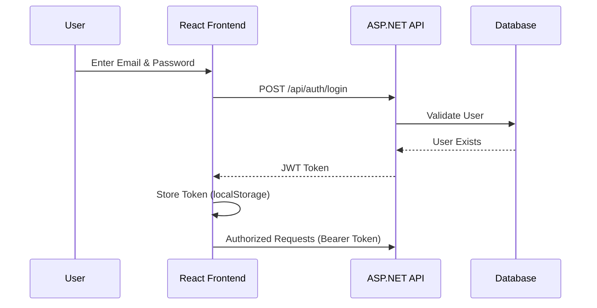
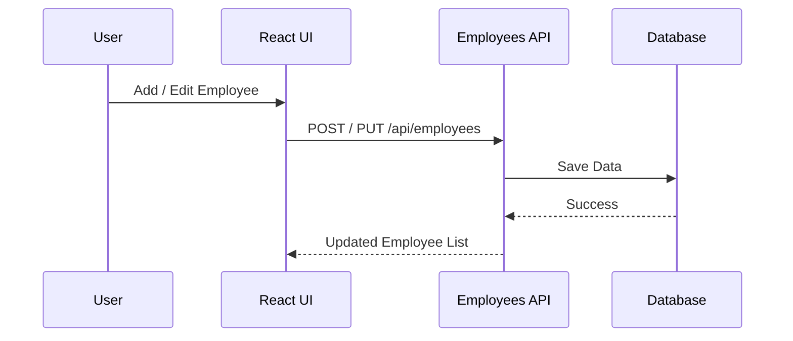

# Employee Management System (EMS)

## 📌 Project Description

Employee Management System (EMS) is a **full-stack web application** designed to manage employees within an organization.  
It provides **secure authentication**, **employee CRUD operations**, and **report generation**, built using **ASP.NET Core Web API**, **Entity Framework Core**, **SQL Server**, and a **modern React + TypeScript frontend** styled with **Tailwind CSS**.

This project follows **real-world enterprise patterns** and is suitable for **learning, assignments, interviews, and portfolio use**.

---

## 🧭 High-Level System Overview

```mermaid
flowchart LR
    User -->|Uses Browser| ReactUI
    ReactUI -->|HTTP Requests| WebAPI
    WebAPI -->|EF Core| SQLServer
    SQLServer -->|Data| WebAPI
    WebAPI -->|JSON / JWT| ReactUI
````

---

## 🏗️ Architecture

```mermaid
flowchart TB
    subgraph Frontend
        React[React + TypeScript]
        Tailwind[Tailwind CSS]
        Axios[Axios + JWT Interceptor]
    end

    subgraph Backend
        API[ASP.NET Core Web API]
        Auth[JWT Authentication]
        EF[Entity Framework Core]
    end

    DB[(SQL Server)]

    React --> Axios
    Axios --> API
    API --> Auth
    API --> EF
    EF --> DB
```

---

## 🔐 Authentication Flow (JWT)



---

## 👥 Employee Management Flow



---

## 📊 Report Generation Flow

```mermaid
flowchart LR
    User --> Click[Download Report]
    Click --> API[/api/reports/employees]
    API --> DB[(SQL Server)]
    DB --> API
    API --> CSV[CSV File]
    CSV --> User
```

---

## 🚀 Features

### 🔐 Authentication

* User registration & login
* JWT token generation
* Secure API access
* Token stored in browser

### 👥 Employee Management

* Add new employee
* Edit existing employee
* Delete employee
* Assign departments
* View employee list

### 📊 Reports

* Download employee data as CSV
* Includes name, email, department, salary

### 🎨 UI / UX

* Clean and responsive UI
* Tailwind CSS styling
* Form validation
* Professional dashboard layout

---

## 🛠️ Tech Stack

### Backend

* ASP.NET Core Web API
* Entity Framework Core
* SQL Server
* JWT Authentication
* Swagger

### Frontend

* React (TypeScript)
* Vite
* Tailwind CSS
* Axios
* React Router

---

## 📂 Project Structure

### Backend (`AssignmentEmployee.Api`)

```
Controllers/
  AuthController.cs
  EmployeesController.cs
  ReportsController.cs

Data/
  ApplicationDbContext.cs

Models/
  Employee.cs
  Department.cs
  Attendance.cs
  User.cs

DTOs/
  LoginDto.cs
  RegisterDto.cs
  EmployeeDto.cs

Repositories/
  EmployeeRepository.cs
  IEmployeeRepository.cs

Services/
  JwtService.cs

Program.cs
```

### Frontend (`employee-frontend`)

```
src/
  components/
    Navbar.tsx
    EmployeeForm.tsx

  pages/
    Login.tsx
    Register.tsx
    Employees.tsx

  context/
    AuthContext.tsx

  services/
    api.ts

  App.tsx
  main.tsx
```

---

## 🧱 Database Design

### Employee Table

* Id
* FullName
* Email
* Salary
* DepartmentId

### Department Table

* Id
* Name

### User Table

* Id
* Email
* PasswordHash
* Role

Departments are seeded automatically:

* HR
* Engineering
* Sales

---

## ▶️ How to Run the Project

### Backend

```bash
dotnet restore
dotnet ef database update
dotnet run
```

Backend URL:

```
https://localhost:7121
```

Swagger:

```
https://localhost:7121/swagger
```

### Frontend

```bash
npm install
npm run dev
```

Frontend URL:

```
http://localhost:5173
```

---

## 🧠 EF Core Notes

* EF Core is used as ORM
* Migrations are required **only when models change**
* Feature additions (edit, reports) do NOT require new migrations

---

## 🔮 Future Enhancements

* Attendance tracking
* Role-based access control
* PDF reports
* Dashboard analytics
* Search & pagination
* Audit logs

---

## 👨‍💻 Author

This project was built as a **full-stack learning & portfolio project**, demonstrating **real-world backend + frontend integration** and clean architecture principles.

---

## ⭐ Support

If you find this project useful, please consider giving it a ⭐ on GitHub.

```
