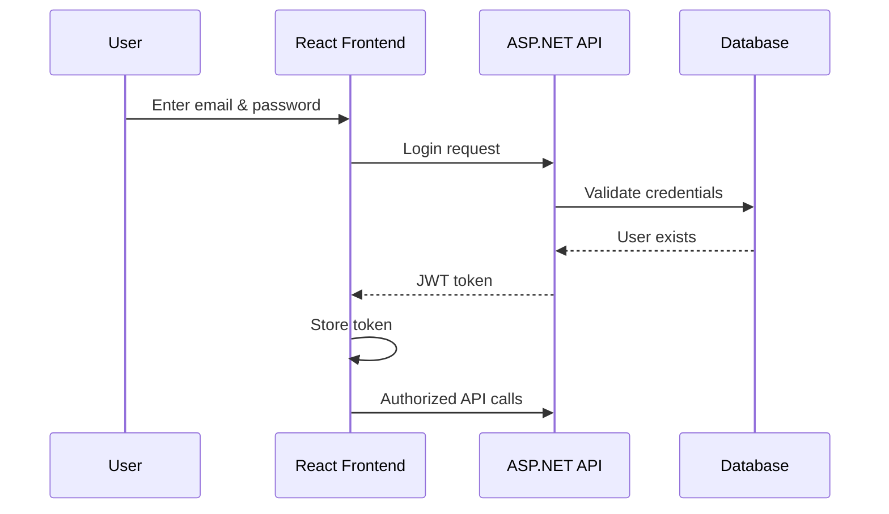
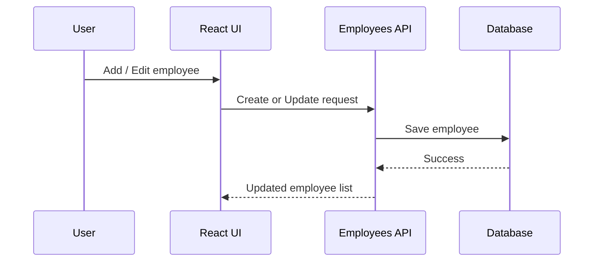
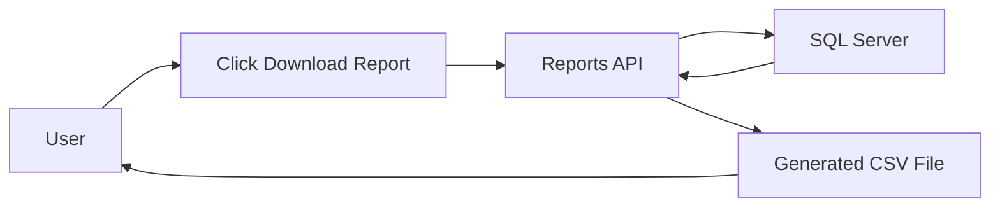

````md
# Employee Management System (EMS)

## 📌 Project Description

Employee Management System (EMS) is a **full-stack web application** designed to manage employees within an organization.

It provides:
- Secure authentication using **JWT**
- Full **employee CRUD operations**
- **Report generation** for employee data

The backend is built using **ASP.NET Core Web API**, **Entity Framework Core**, and **SQL Server**, while the frontend uses **React + TypeScript** with **Tailwind CSS** for a modern, responsive UI.

This project follows **real-world enterprise patterns** and is suitable for **learning, assignments, interviews, and portfolio use**.

---

## 🧭 High-Level System Overview

This diagram shows how data flows through the system at a high level.

```mermaid
flowchart LR
    User["User (Browser)"] --> ReactUI["React Frontend"]
    ReactUI --> API["ASP.NET Core Web API"]
    API --> DB["SQL Server (EF Core)"]
    DB --> API
    API --> ReactUI
````

### Explanation

1. The **user** interacts with the React frontend.
2. React sends HTTP requests to the backend API.
3. The API uses **EF Core** to read/write data from SQL Server.
4. Responses (JSON / JWT) flow back to the UI.

---

## 🏗️ Architecture Overview

This shows how frontend and backend responsibilities are separated.

```mermaid
flowchart TB
    subgraph Frontend
        React["React + TypeScript"]
        Axios["Axios (JWT Interceptor)"]
        Tailwind["Tailwind CSS"]
    end

    subgraph Backend
        API["ASP.NET Core Web API"]
        Auth["JWT Authentication"]
        EF["Entity Framework Core"]
    end

    DB["SQL Server"]

    React --> Axios
    Axios --> API
    API --> Auth
    API --> EF
    EF --> DB
```

### Explanation

* **Frontend** handles UI and user interaction
* **Axios interceptor** automatically attaches JWT token
* **Backend API** validates token and processes requests
* **EF Core** maps C# models to database tables

---

## 🔐 Authentication Flow (JWT)



### Explanation

1. User logs in via the UI
2. Backend validates credentials
3. Backend returns a **JWT token**
4. Token is stored in browser
5. Token is sent with every secured request

---

## 👥 Employee Management Flow



### Explanation

* Same UI handles **Add** and **Edit**
* Backend decides action based on HTTP method
* Updated data is immediately reflected in UI

---

## 📊 Report Generation Flow



### Explanation

1. User clicks **Download Report**
2. Frontend calls Reports API
3. Backend fetches employee data
4. Data is converted to CSV
5. Browser downloads the file

---

## 🚀 Features

### 🔐 Authentication

* User registration & login
* JWT-based security
* Protected API endpoints

### 👥 Employee Management

* Add employee
* Edit employee
* Delete employee
* Assign departments
* View employee list

### 📊 Reports

* Export employees as CSV
* Includes department & salary

### 🎨 UI / UX

* Responsive design
* Tailwind CSS
* Clean forms & layouts

---

## 🛠️ Tech Stack

### Backend

* ASP.NET Core Web API
* Entity Framework Core
* SQL Server
* JWT Authentication
* Swagger

### Frontend

* React (TypeScript)
* Vite
* Tailwind CSS
* Axios
* React Router

---

## 🧱 Database Design

### Employee

* Id
* FullName
* Email
* Salary
* DepartmentId

### Department

* Id
* Name

### User

* Id
* Email
* PasswordHash
* Role

Departments are seeded automatically:

* HR
* Engineering
* Sales

---

## ▶️ How to Run the Project

### Backend

```bash
dotnet restore
dotnet ef database update
dotnet run
```

### Frontend

```bash
npm install
npm run dev
```

---

## 🧠 EF Core Notes

* EF Core handles database access
* Migrations are required only when models change
* Feature additions do not require schema changes

---

## 🔮 Future Enhancements

* Attendance tracking
* Role-based access
* PDF reports
* Analytics dashboard
* Search & pagination

---

## 👨‍💻 Author

Built as a **full-stack portfolio project** demonstrating real-world architecture, security, and UI best practices.

---

## ⭐ Support

If you find this project useful, please give it a ⭐ on GitHub.

```

---

# 🧠 WHY THIS VERSION IS BETTER

✔ Mermaid **renders perfectly on GitHub**  
✔ Each diagram has **plain-English explanation**  
✔ Clear separation of **what happens vs how it works**  
✔ Interviewer-friendly  
✔ Beginner-friendly  
✔ Production-grade documentation

---

If you want next:
- ER diagram (database-focused)
- API request/response examples
- Deployment flow (Azure / IIS)
- Resume-ready explanation

Just tell me 👍
```
