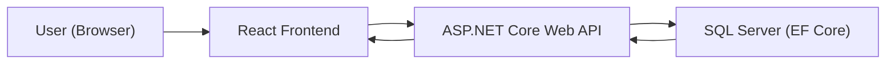
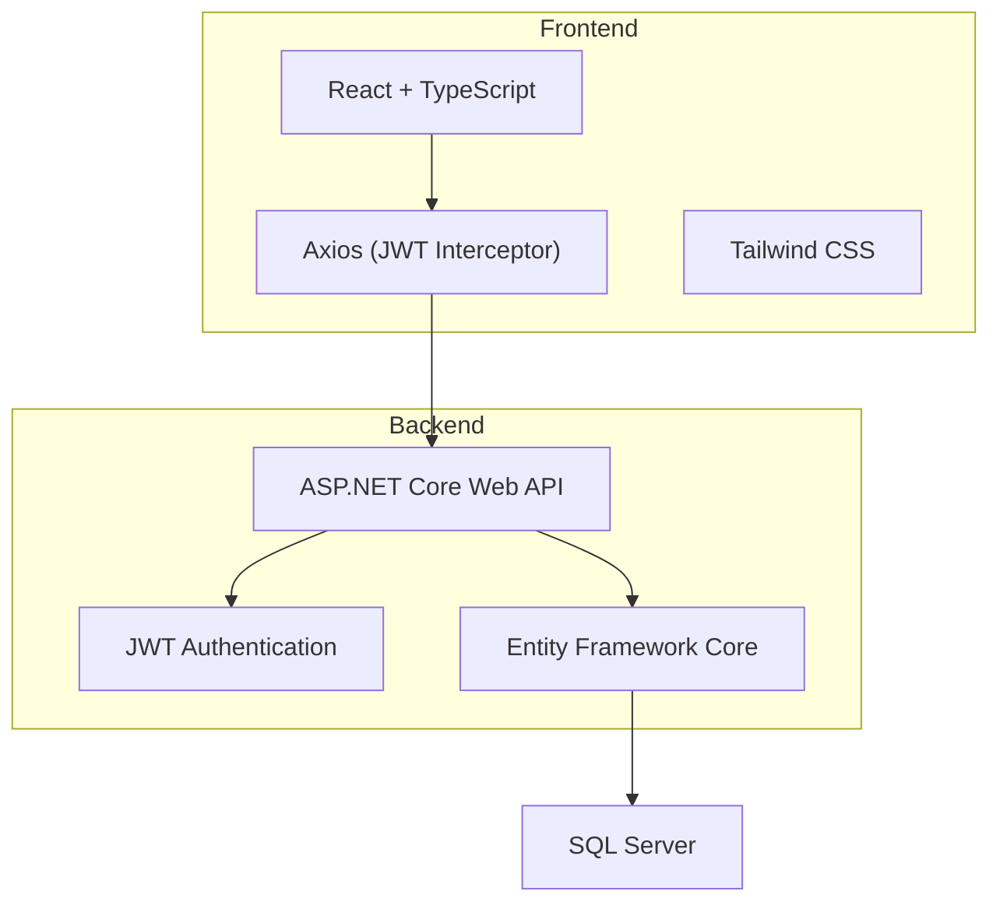
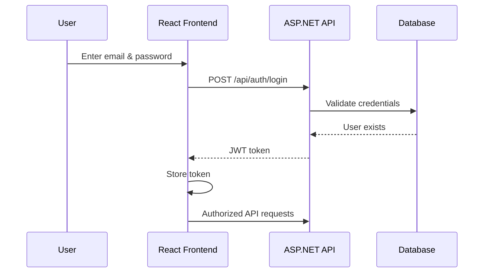
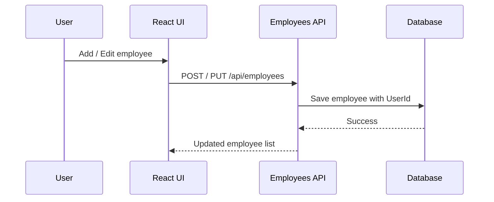
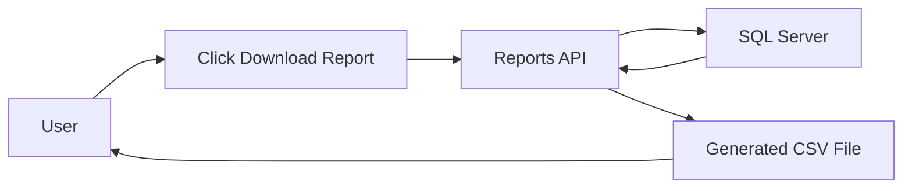

# 🧑‍💼 Employee Management System (EMS)

## 📌 Project Description

Employee Management System (EMS) is a **full-stack web application** built to manage employees in a secure, real-world way.

Unlike basic CRUD demos, this project correctly implements:

* **JWT-based authentication**
* **User-specific dashboards**
* **Backend-enforced data ownership**
* Full **employee CRUD operations**
* **Report generation** for employee data

Each registered user has **their own private set of employees**.
When a user logs in, they see **only the data they created** — not anyone else’s.

The backend is built using **ASP.NET Core Web API**, **Entity Framework Core**, and **SQL Server**, while the frontend uses **React + TypeScript** with **Tailwind CSS**.

This project is suitable for **learning**, **assignments**, **interviews**, and **portfolio demonstration**.

---

## 🧭 High-Level System Overview

This diagram shows how requests and data flow through the system.



### What’s happening here?

1. The **user** interacts with the React UI.
2. React sends HTTP requests (with JWT) to the backend API.
3. The API validates the token and processes the request.
4. **Entity Framework Core** reads/writes data in SQL Server.
5. The response flows back to the frontend as JSON.

---

## 🏗️ Architecture Overview

This diagram shows responsibility separation between frontend and backend.



### Key ideas

* The **frontend** focuses only on UI and user interaction
* **Axios** automatically attaches the JWT token
* The **backend** is responsible for all security decisions
* **EF Core** maps C# models to relational tables

---

## 🔐 Authentication Flow (JWT)



### Explanation

1. User logs in from the UI
2. Backend validates credentials
3. Backend generates a **JWT token** containing the user ID
4. Token is stored in the browser
5. Token is sent with every protected API request

---

## 👥 Employee Ownership & Data Isolation (IMPORTANT)

This project enforces **user-based data isolation**.

### How it works

* Each **Employee** record contains a `UserId`
* `UserId` is extracted from the **JWT token**
* Backend filters data using `UserId`

### Result

| Scenario        | Outcome                      |
| --------------- | ---------------------------- |
| User A logs in  | Sees only User A’s employees |
| User B logs in  | Sees only User B’s employees |
| User A logs out | Session cleared              |
| No token        | Redirected to login          |

This isolation is enforced **on the backend**, not the frontend.

---

## 👥 Employee Management Flow



### Explanation

* Same form handles **Add** and **Edit**
* Backend assigns ownership using JWT
* Dashboard always reloads user-specific data

---

## 📊 Report Generation Flow



### Explanation

1. User clicks **Download Report**
2. Frontend calls Reports API
3. Backend fetches user-specific employees
4. Data is converted to CSV
5. Browser downloads the file

---

## 🚀 Features

### 🔐 Authentication

* User registration
* Secure login
* JWT-based authentication
* Protected API endpoints

### 👥 Employee Management

* Add employees
* Edit employees
* Delete employees
* Assign departments
* User-specific dashboards

### 📊 Reports

* Export employee data as CSV
* Includes department and salary

### 🎨 UI / UX

* Responsive layout
* Tailwind CSS styling
* Clean and professional forms

---

## 🛠️ Tech Stack

### Backend

* ASP.NET Core Web API
* Entity Framework Core
* SQL Server
* JWT Authentication
* Swagger / OpenAPI

### Frontend

* React (TypeScript)
* Vite
* Tailwind CSS
* Axios
* React Router

---

## 🧱 Database Design

### Users

* Id
* Email
* PasswordHash
* Role

### Employees

* Id
* FullName
* Email
* Salary
* DepartmentId
* **UserId (FK → Users)**

### Departments

* Id
* Name

Seeded departments:

* HR
* Engineering
* Sales

---

## ▶️ How to Run the Project

### Backend

```bash
dotnet restore
dotnet ef database update
dotnet run
```

Backend URL:

```
https://localhost:7121
```

Swagger:

```
https://localhost:7121/swagger
```

---

### Frontend

```bash
npm install
npm run dev
```

Frontend URL:

```
http://localhost:5173
```

---

## 🧠 EF Core Notes

* EF Core is used as the ORM
* Migrations are required only when models change
* Data isolation is enforced using foreign keys and query filtering

---

## 🔮 Future Enhancements

* Attendance tracking
* Role-based access control (Admin/User)
* PDF report generation
* Dashboard analytics
* Search & pagination

---

## 👨‍💻 Author

Built as a **full-stack portfolio project** to demonstrate **secure authentication, clean architecture, and user-based data isolation** using modern web technologies.

---

## ⭐ Support

If this project helped you understand **real-world authentication and data ownership**, please consider giving it a ⭐ on GitHub.
