# 🧑‍💼 Employee Management System (EMS)

A **production-style full-stack application** built with **ASP.NET Core Web API** and **React + TypeScript**, demonstrating **secure authentication, backend-enforced data isolation, reporting, and real-world CRUD workflows**.


---

## 📌 Project Overview (Recruiter Summary)

**Employee Management System (EMS)** allows users to:

* Register & log in securely using **JWT authentication**
* Manage **their own employees only** (strict backend data isolation)
* Perform full **CRUD operations** on employees
* Assign employees to **departments**
* Track **daily attendance** (present / absent + history)
* Export employee data as **CSV and PDF**
* Use a modern, responsive UI with search & pagination

Each user has a **private workspace** — no user can see or modify another user’s data.

---

## 🧭 High-Level Request / Response Flow


### What this shows

1. The user interacts with the **React UI**
2. The frontend sends API requests with a **JWT token**
3. The backend validates the token and extracts the **UserId**
4. Data is read/written via **Entity Framework Core**
5. Responses (JSON / CSV / PDF) return to the UI

---

## 🏗 Architecture & Responsibilities

```mermaid
flowchart TB
  subgraph Frontend
    F1["React + TypeScript"]
    F2["Axios (api.ts) – JWT Interceptor"]
    F3["Tailwind UI & Components"]
  end

  subgraph Backend
    B1["ASP.NET Core Web API"]
    B2["Controllers (Auth, Employees, Attendance, Reports)"]
    B3["JWT Service"]
    B4["PDF Generator (PdfSharpCore)"]
    B5["EF Core (ApplicationDbContext)"]
  end

  DB["SQL Server"]

  F1 --> F2
  F2 --> B1

  B1 --> B3
  B1 --> B2

  B2 --> B5
  B5 --> DB

  B2 --> B4

  B1 --> F1
```



### Clear separation of concerns

#### Frontend (React)

* UI rendering & user experience
* Form handling and validation
* Search & pagination
* Secure file downloads (CSV / PDF)
* Route protection (private routes)

#### Axios Layer

* Centralized HTTP client
* Automatically attaches `Authorization: Bearer <token>`
* Handles binary responses (`blob`) for reports

#### Backend (ASP.NET Core)

* Authentication & authorization
* **User ownership enforcement**
* Business rules & validation
* Report generation (CSV / PDF)

#### Database

* SQL Server via EF Core
* Strong relational model with foreign keys

---

## 🔐 Authentication & Data Isolation (Critical Design)

### How authentication works

1. User logs in via `/api/auth/login`
2. Backend validates credentials
3. Backend issues a **JWT token** containing the user ID
4. Frontend stores token and attaches it to every request

### How data isolation is enforced

* Every `Employee` record includes `UserId`
* `UserId` is extracted from the JWT on the backend
* All queries are filtered by `UserId`

---

## 👥 Core Features

### 🔐 Authentication

* User registration
* Secure login with JWT
* Protected API endpoints

### 👥 Employee Management

* Add employee
* Edit employee
* Delete employee
* Assign department
* User-specific dashboard

### 📋 Table List (Advanced View)

* Dedicated table page
* Search by name/email
* Client-side pagination
* Edit & delete actions

### 🕒 Attendance Tracking

* Mark present / absent
* One record per employee per day (upsert logic)
* View attendance history

### 📊 Reports

* Export employees as **CSV** (Excel-friendly)
* Export employees as **PDF** (server-generated)
* User-specific data only

---

## 📡 API Endpoints (Complete)

> All endpoints below require
> `Authorization: Bearer <JWT>` (except register/login)

### Auth

* `POST /api/auth/register`
* `POST /api/auth/login`
* `GET /api/auth/me`

### Employees

* `GET /api/employees`
* `GET /api/employees/{id}`
* `POST /api/employees`
* `PUT /api/employees/{id}`
* `DELETE /api/employees/{id}`

### Departments

* `GET /api/departments`

### Attendance

* `POST /api/attendance`
* `GET /api/attendance/{employeeId}`

### Reports

* `GET /api/reports/employees/csv`
* `GET /api/reports/employees/pdf`

---

## 🧱 Database Design

### Users

* Id
* Email
* PasswordHash
* Role

### Employees

* Id
* FullName
* Email
* Salary
* DepartmentId
* **UserId (FK → Users)**

### Departments

* Id
* Name
  *(Seeded: HR, Engineering, Sales)*

### Attendance

* Id
* EmployeeId
* Date
* Present

---

## ▶️ How to Run the Project

### Backend (ASP.NET Core)

```bash
dotnet restore
dotnet ef database update
dotnet run
```

* API: `https://localhost:7121`
* Swagger: `https://localhost:7121/swagger`

---

### Frontend (React + Vite)

```bash
npm install
npm run dev
```

* Frontend: `http://localhost:5173`

---

## 🛠 Important Technical Notes

* PDF generation uses **PdfSharpCore**
* CSV & PDF downloads are handled using `responseType: 'blob'`
* Axios interceptor is fully typed (no `any`)
* React hooks follow strict lint rules (no invalid effects)
* Salary uses numeric input handling
* Department dropdown is correctly populated during edit

---

## 🚀 Production Readiness (What to Improve)

* Hash passwords (BCrypt / ASP.NET Identity)
* Store JWT secret in environment variables
* Use HttpOnly cookies instead of localStorage
* Add server-side pagination
* Add role-based access (Admin/User)
* Add CI/CD pipeline
* Add audit logs & monitoring

---

## 🧠 How to Explain This Project in Interviews

You can confidently explain:

* JWT authentication end-to-end
* Backend-enforced multi-tenancy
* Why PDF generation belongs on the server
* How frontend securely downloads binary files
* How EF Core enforces ownership constraints
* Tradeoffs and production improvements

---

## 👨‍💻 Author

Built as a **full-stack portfolio project** to demonstrate real-world system design, security, and clean architecture using modern web technologies.

---

## ⭐ Support

If this project helped you understand **secure full-stack application design**, please consider giving it a ⭐ on GitHub.

---

